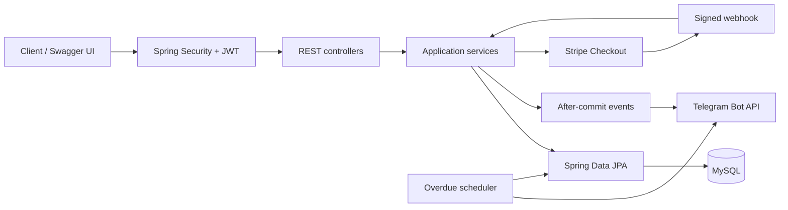

<div align="center">


# Car Sharing Service

REST API for managing a car-sharing fleet, rentals, payments, and customer notifications.

[](https://github.com/vDmytriv01/car-sharing-service/actions/workflows/ci.yml)


</div>

## About the project

Car Sharing Service is a REST API for a complete car rental flow. Managers maintain the fleet, customers rent and return available cars, Stripe handles rental payments and overdue fines, and Telegram sends operational notifications.

The main business rules are handled in the service and database layers. Creating or returning a rental updates inventory in the same transaction, a database constraint prevents duplicate payment records, and Stripe events are accepted only after their signature has been checked. The repository also includes migrations, automated tests, Docker Compose, CI, and OpenAPI documentation.

## Features

### Customer flow

- register and authenticate with a JWT;
- browse, filter, sort, and paginate the car catalogue;
- create a rental only when inventory is available;
- see only personal rentals and payments;
- return a rented car;
- create a Stripe Checkout session for a rental payment or overdue fine;
- safely repeat a payment request without creating a duplicate payment.

### Manager flow

- create, update, partially update, and soft-delete cars;
- view rentals and payments across all customers;
- filter rentals by customer and active status;
- change user roles;
- receive Telegram notifications about new rentals and completed payments;
- receive a scheduled summary of overdue rentals.

### Important implementation details

- Spring Security authenticates requests with signed JWT access tokens and stores passwords as BCrypt hashes.
- Endpoint rules separate customer operations from manager-only fleet and user management.
- Rental creation locks the selected car row before checking and decreasing inventory.
- Returning a rental locks the rental and car rows, records the actual return date, and restores inventory in one transaction.
- The `(rental_id, type)` database constraint and Stripe idempotency key prevent duplicate rental payments and fines.
- The webhook handler verifies the Stripe signature before updating a payment to `PAID`.
- Notifications are sent only after the related database update succeeds. Telegram failures are logged without rolling back completed business operations.
- Liquibase manages the schema, constraints, and initial reference data.
- The Docker image uses a multi-stage build and a non-root runtime user. Compose also configures database and application health checks.

## Architecture



The application stays as one Spring Boot service because the current domain does not need separate deployments. HTTP handling, business logic, and persistence are split into controller, service, and repository packages. Stripe and Telegram are kept behind small integration classes so their SDK and HTTP details do not spread through the rental code.

## Domain model

| Entity | Responsibility |
|---|---|
| `User` | Customer or manager account and credentials |
| `Car` | Fleet vehicle, type, daily fee, and available inventory |
| `Rental` | Planned and actual rental dates linked to a car and customer |
| `Payment` | Stripe session, amount, status, and payment type for a rental |

Payment types are `PAYMENT` and `FINE`. Payment statuses are `PENDING` and `PAID`. A rental becomes overdue only after its planned return date has passed.

## Technology stack

| Area | Technology |
|---|---|
| Language and runtime | Java 21, Spring Boot 4.1 |
| Web and validation | Spring MVC, Jakarta Validation |
| Security | Spring Security, JWT, BCrypt |
| Persistence | Spring Data JPA, Hibernate, MySQL 8.4 |
| Database migrations | Liquibase |
| Payments | Stripe Checkout and signed webhooks |
| Notifications | Telegram Bot API, Spring events, scheduled jobs |
| API documentation | Springdoc OpenAPI and Swagger UI |
| Testing | JUnit 5, Mockito, MockMvc, Testcontainers, JaCoCo |
| Delivery | Maven Wrapper, Checkstyle, Docker Compose, GitHub Actions |

## API overview

| Method | Endpoint | Access | Purpose |
|---|---|---|---|
| `POST` | `/register` | Public | Register a customer |
| `POST` | `/login` | Public | Receive a JWT |
| `GET` | `/users/me` | Authenticated | View the current profile |
| `PUT`, `PATCH` | `/users/me` | Authenticated | Update the current profile |
| `PUT` | `/users/{id}/role` | Manager | Change a user role |
| `GET` | `/cars`, `/cars/{id}` | Public | Browse the fleet |
| `POST` | `/cars` | Manager | Add a car |
| `PUT`, `PATCH`, `DELETE` | `/cars/{id}` | Manager | Maintain the fleet |
| `GET`, `POST` | `/rentals` | Authenticated | List or create rentals |
| `GET` | `/rentals/{id}` | Authenticated | View an accessible rental |
| `POST` | `/rentals/{id}/return` | Authenticated | Return a car |
| `GET`, `POST` | `/payments` | Authenticated | List or create payments |
| `GET` | `/payments/success`, `/payments/cancel` | Public | Handle Checkout redirects |
| `POST` | `/payments/webhook` | Stripe | Process signed payment events |
| `GET` | `/actuator/health` | Public | Read application health |

The live OpenAPI specification contains the exact request models, validation rules, response schemas, and authorization requirements.

## Run with Docker Compose

### Prerequisites

- Docker Desktop or Docker Engine with Compose;
- a Stripe test-mode secret key;
- a Stripe webhook signing secret;
- a Telegram bot token and target chat ID.

### 1. Configure the environment

```bash
cp .env.sample .env
```

On Windows PowerShell:

```powershell
Copy-Item .env.sample .env
```

Generate a strong JWT secret:

```bash
openssl rand -base64 48
```

Fill the required values in `.env`:

```dotenv
JWT_SECRET=<generated-secret>
MYSQL_PASSWORD=<application-db-password>
MYSQL_ROOT_PASSWORD=<root-db-password>
STRIPE_SECRET_KEY=sk_test_...
STRIPE_WEBHOOK_SECRET=whsec_...
TELEGRAM_BOT_TOKEN=<bot-token>
TELEGRAM_CHAT_ID=<chat-id>
```

`.env` is excluded from Git. Never commit real credentials.

### 2. Bootstrap the first manager

Public registration intentionally creates only customers. For the first startup, add these values to `.env`:

```dotenv
BOOTSTRAP_MANAGER_ENABLED=true
BOOTSTRAP_MANAGER_EMAIL=manager@example.com
BOOTSTRAP_MANAGER_FIRST_NAME=Fleet
BOOTSTRAP_MANAGER_LAST_NAME=Manager
BOOTSTRAP_MANAGER_PASSWORD=<strong-password>
```

The startup runner creates the manager if the email is new, or promotes the existing account with that email. After the first successful startup, set `BOOTSTRAP_MANAGER_ENABLED=false` and restart the application. The manager remains in the database volume.

### 3. Start the application

```bash
docker compose up --build -d
docker compose ps
```

Open:

- Swagger UI: <http://localhost:8080/swagger-ui.html>
- OpenAPI JSON: <http://localhost:8080/v3/api-docs>
- Health check: <http://localhost:8080/actuator/health>

Follow application logs:

```bash
docker compose logs -f app
```

Stop containers without deleting data:

```bash
docker compose down
```

Delete containers and the local database volume:

```bash
docker compose down -v
```

The last command permanently removes local database data.

## Try the API

Swagger UI is the easiest manual test client. A minimal command-line flow looks like this:

```bash
curl -X POST http://localhost:8080/register \
  -H "Content-Type: application/json" \
  -d '{
    "email": "customer@example.com",
    "firstName": "Test",
    "lastName": "Customer",
    "password": "Password123"
  }'

curl -X POST http://localhost:8080/login \
  -H "Content-Type: application/json" \
  -d '{
    "email": "customer@example.com",
    "password": "Password123"
  }'
```

Copy the returned token, click **Authorize** in Swagger UI, and enter it as a bearer token.

The following sequence is useful for a manual smoke test:

1. Sign in as the bootstrap manager and create a car with one available unit.
2. Sign in as a customer, find the car through `GET /cars`, and create a rental.
3. Check that the available inventory decreased to zero and that Telegram received the rental notification.
4. Create a `PAYMENT` through `POST /payments` and open the returned Checkout URL.
5. Complete the payment in Stripe test mode and check that the signed webhook changed its status to `PAID`.
6. Repeat the payment request and confirm that it does not create another payment for the same rental.
7. Return the rental and check that the car is available again.

Car search parameters can be combined like a small query constructor:

```text
GET /cars?brand=toyota&type=SUV&available=true&minDailyFee=30&maxDailyFee=100&page=0&size=20&sort=dailyFee,asc
```

## Stripe local webhooks

Install and authenticate the Stripe CLI, then forward test events to the application:

```bash
stripe login
stripe listen --forward-to localhost:8080/payments/webhook
```

Copy the displayed `whsec_...` value to `STRIPE_WEBHOOK_SECRET` in `.env` and restart the app container:

```bash
docker compose up --build -d app
```

Create a rental payment through the API and complete it with a Stripe test card. The signed `checkout.session.completed` event changes the stored payment to `PAID`. Delivering the same event again is safe because the database update is idempotent.

## Access from another network

The Compose port is bound to localhost by default. For a temporary public HTTPS URL during a demo, run a Cloudflare Quick Tunnel on the host:

```bash
cloudflared tunnel --url http://localhost:8080
```

Set `APP_BASE_URL` to the generated HTTPS address before creating Stripe sessions so callback URLs are correct. This is a development tunnel: the API remains available only while the computer, Docker, the application, and the tunnel are running.

## Run and test locally

Local execution requires Java 21, Docker, and the environment values from `.env`. Docker is needed because integration tests start a real MySQL 8.4 container.

On macOS or Linux:

```bash
./mvnw clean verify
```

On Windows:

```powershell
.\mvnw.cmd clean verify
```

The `verify` lifecycle runs:

- unit, repository, API integration, and concurrency tests;
- MySQL integration tests through Testcontainers;
- Checkstyle validation;
- a JaCoCo coverage check with a 60% minimum line threshold.

CI repeats the Maven verification, validates the Compose configuration, and builds the production Docker image for each pull request.

## Configuration reference

| Variable | Required | Description |
|---|---:|---|
| `JWT_SECRET` | Yes | Base64 JWT signing secret |
| `JWT_ISSUER`, `JWT_EXPIRATION` | No | Token issuer and lifetime |
| `MYSQL_DATABASE`, `MYSQL_USER` | Yes | Application database and user |
| `MYSQL_PASSWORD`, `MYSQL_ROOT_PASSWORD` | Yes | Database credentials |
| `STRIPE_SECRET_KEY` | Yes | Stripe test or live API key |
| `STRIPE_WEBHOOK_SECRET` | Yes | Stripe webhook signing secret |
| `TELEGRAM_BOT_TOKEN`, `TELEGRAM_CHAT_ID` | Yes | Notification destination |
| `APP_BASE_URL` | Yes | Public base URL used in Stripe callbacks |
| `OVERDUE_NOTIFICATION_CRON` | No | Daily scheduler cron expression |
| `OVERDUE_NOTIFICATION_ZONE` | No | Business time zone for overdue checks |
| `BOOTSTRAP_MANAGER_*` | Only for bootstrap | One-time initial manager configuration |

See [`.env.sample`](.env.sample) for the complete list and safe defaults.

## Project structure

```text
src/main/java/com/vdmytriv/carsharing
├── config          # Security, OpenAPI, integrations, runtime configuration
├── controller      # HTTP endpoints
├── dto             # Validated request and response contracts
├── exception       # Consistent API error handling
├── mapper          # Entity/DTO mapping
├── model           # JPA domain entities and enums
├── notification    # Telegram client, events, and overdue scheduler
├── payment         # Stripe gateway and webhook verification
├── repository      # Spring Data repositories and specifications
├── security        # JWT generation and request authentication
├── service         # Business rules and transaction boundaries
└── validation      # Shared request validation
```

Database changes are under `src/main/resources/db/changelog`, and tests mirror the production packages under `src/test/java`.

## Current scope

The current version is intended for local development and a Docker-based demo. Public CI uses isolated test configuration, so it does not call real Stripe or Telegram accounts. A deployment and Infrastructure as Code are planned as a separate stage; the application is not currently hosted on AWS.

The functional scope follows the [Mate Academy car-sharing service specification](https://github.com/mate-academy/jv-car-sharing-service).
